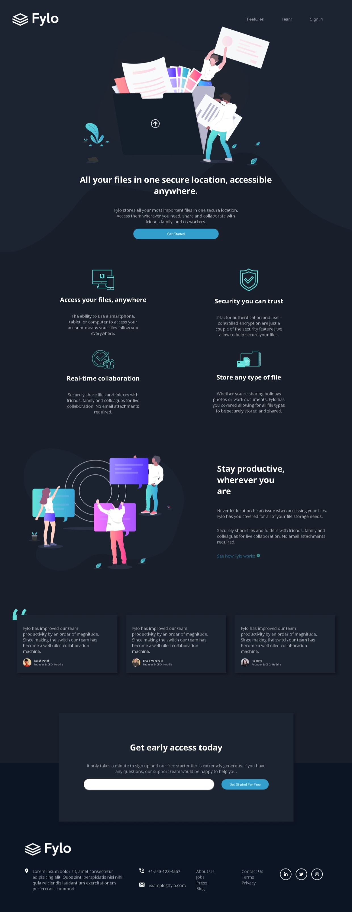

# Frontend Mentor - Fylo dark theme landing page solution

This is a solution to the [Fylo dark theme landing page challenge on Frontend Mentor](https://www.frontendmentor.io/challenges/fylo-dark-theme-landing-page-5ca5f2d21e82137ec91a50fd). Frontend Mentor challenges help you improve your coding skills by building realistic projects. 

## Table of contents

- [Overview](#overview)
  - [The challenge](#the-challenge)
  - [Screenshot](#screenshot)
  - [Links](#links)
- [My process](#my-process)
  - [Built with](#built-with)
  - [Continued development](#continued-development)
- [Author](#author)

## Overview

### The challenge

Users should be able to:

- View the optimal layout for the site depending on their device's screen size
- See hover states for all interactive elements on the page

### Screenshot

### Links

- Solution URL: [Add solution URL here](https://github.com/Kaji17/Fylo-landing-page-)
- Live Site URL: [Add live site URL here](https://kaji17.github.io/Fylo-landing-page-/)

## My process

### Built with

- Semantic HTML5 markup
- CSS custom properties
- Flexbox
- Mobile-first workflow
- [Font Awesome](https://fontawesome.com/) - For social icon

### Continued development

I'm learning API rest to add in my future project in target to become a fullstack dev

## Author

- Linkedin - [Katina Pê Virgile Ouattara](https://www.linkedin.com/in/katinaouattara/)
- Frontend Mentor - [@Kaji17](https://www.frontendmentor.io/profile/Kaji17)
- Twitter - [@pevirgile](https://twitter.com/pevirgile)